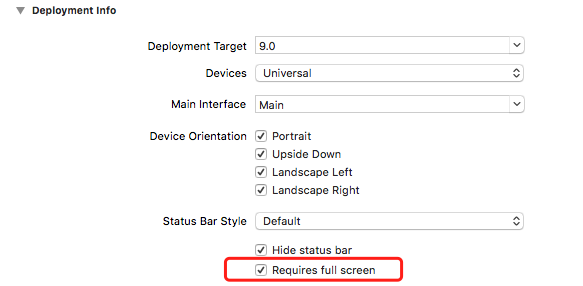
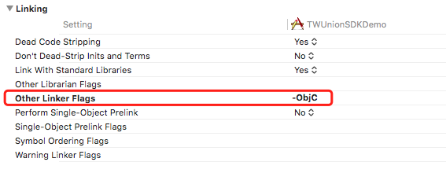
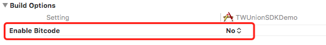
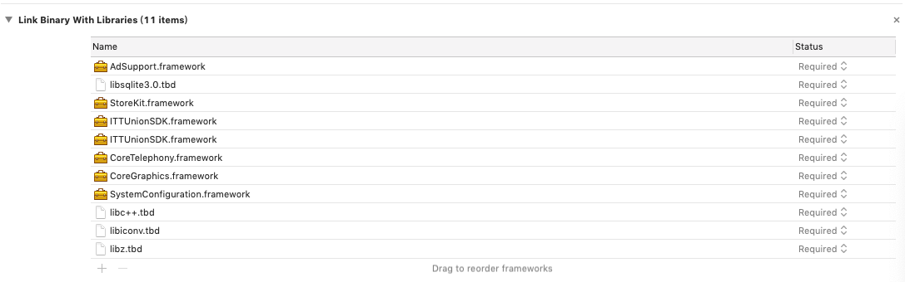

# iOS SDK 接入

**修改记录**

| 修订号   | 修改描述       | 修改日期       |
| ----- | -------- |  ---------- |
| 1.0.0 | 初稿完成       | 2020-10-23 |
| 1.1.0 | 增加了获取提审状态的接口      | 2020-10-26 |

本文为iOS客户端接入本SDK的使用教程，只涉及SDK的使用方法，默认读者已经熟悉IDE的基本使用方法（本文以Xcode为例），以及具有相应的编程知识基础等。

### 准备阶段

- 需要先将游戏内的可购买商品列表发送给发行商，物品属性包含物品id、物品价格、物品在游戏中对应的点数、物品描述等
- 发行商向开发商提供`appId`、`appSecret`、`sdkUrl`等配置信息

### 一、游戏配置

#### 1.1 Info.plist配置

**配置游戏聚合平台参数**

在`Info.plist`里添加**游戏ID**和**游戏渠道ID**，其中的`appId`、`channelId`、`initUrl`值是IctitanUnion平台分配的值

源码方式添加如下：

```xml
<key>IctitanUnionAppId</key>
<string>{AppId}</string>
<key>IctitanUnionChannelId</key>
<string>{ChannelId}</string>
<key>IctitanUnionInitUrl</key>
<string>{InitUrl}</string>
```

**配置网络(使用HTTP)**

在`TARGETS -> Info -> Custom iOS Target Properties`中添加`App Transport Security Settings`，并设置`Allow Arbitrary Loads`为`YES`


源码方式添加如下：

```xml
<key>NSAppTransportSecurity</key>
<dict>
    <key>NSAllowsArbitraryLoads</key>
    <true/>
</dict>
```

**配置本地语言可获取**

在`TARGETS -> Info -> Custom iOS Target Properties`中添加`Localized resources can be mixed`和`Privacy - Photo Library Usage Description`，并设置`Allow Arbitrary Loads`为`YES`

#### 1.2 通用配置

**配置全屏**

在`TARGETS -> General -> Deployment Info -> Status Bar Style`中勾选上`Requires full screen`



**开启三方静态库**

在`TARGET -> Build Settings -> Linking -> Other Liker Flags`中添加`-ObjC`



**关闭bitcode**

将`TARGET -> Build Settings -> Build Options -> Enable Bitcode`设置成`No`



**设置依赖库**

在`TARGET -> Build Phases`中添加如下依赖库



### 二、游戏调用平台

注：以下接口暂只提供直Objective-C层，具体Objective-C层与游戏层数据交互由接入方自行实现

#### 2.1 初始化(必接)

请在iOS程序的`AppDelegate.m`里的`(BOOL)application:didFinishLaunchingWithOptions:`进行调用：

引入header文件

```objective-c
#import "PYChannelSDK.h"
```

在`(BOOL)application:(UIApplication *)application didFinishLaunchingWithOptions:(NSDictionary *)launchOptions`插入如下代码:

```objective-c
- (BOOL)application:(UIApplication *)application didFinishLaunchingWithOptions:(NSDictionary *)launchOptions {
    ...
    [[PYChannelSDK sharedInstance] init:@"SDK分配的应用ID"];

    ...
    return YES;
}
```

#### 2.2 切换SDK显示语言(必接)

此方法适用于多地区多语言发行的手游。研发商可以在游戏的任何地方使用此方法，SDK会根据选择的语言进行切换。

引入header文件

```objective-c
#import "PYChannelSDK.h"
```

事件中插入如下代码：

```objective-c
// 使用SDK登录界面
[[PYChannelSDK sharedInstance] switchLanguage:@"en"];
```

所有的语言`language`请参考附录中的[显示语言](#显示语言)

#### 2.3 登录(必接)

SDK提供给研发商两种接入登录的方式：
1. SDK提供登录弹出界面，包含帐号、密码登录和各种三方登录
2. 不使用SDK的登录界面，游戏自己实现各种三方登录的按钮

研发商根据需要选择一种方式接入。

引入header文件

```objective-c
#import "PYChannelSDK.h"
```

事件中插入如下代码：

```objective-c
// 使用SDK登录界面
[[PYChannelSDK sharedInstance] login];

// 不使用SDK登录界面，游戏自己实现Google、Facebook、还有游客登录的按钮；当按钮被点击时，分别调用以下接口
// Google举例
[[PYChannelSDK sharedInstance] loginWithThirdParty:@"google_ios"];
```

所有的帐号类型`accountType`请参考附录中的[三方帐号类型](#三方帐号类型)

#### 2.4 是否显示三方登录按钮(选接)

当研发商选择游戏自己实现Google、Facebook等三方登录按钮的情况下，必须先调用此接口，如果返回`true`，才能在游戏中显示相关按钮；如果研发商选择使用SDK的登录界面，此接口不用接入。**注意：此接口必须在初始化成功之后才能使用**

引入header文件

```objective-c
#import "PYChannelSDK.h"
```

事件中插入如下代码：

```objective-c
if ([[PYChannelSDK sharedInstance] showThirdPartyLoginButton:@"google_ios"]) {
    // 游戏中显示Google登录按钮
} else {
    // 游戏中隐藏Google登录按钮
}
```

所有的帐号类型`accountType`请参考附录中的[三方帐号类型](#三方帐号类型)

#### 2.5 获取提审状态(选接)

当游戏在各应用市场进行提审过程的时候，游戏客户端中需要展现特定的状态。比如登录方式，是否可以分享，内购商品的显示切换等。**注意：此接口必须在初始化成功之后才能使用**

```objective-c
if ([[PYChannelSDK sharedInstance] getReviewStatus]) {
    // 游戏中显示提审状态
} else {
    // 游戏中显示正式状态
}
```

#### 2.6 支付(必接)

本接口中sign签名请 [参考签名规则](server-api-overview.md#签名规则)，**参与签名计算的参数包含appId、accountId、token、productId、roleId、serverId、amount、currency、extra**。为了保障支付的安全性，签名计算请在游戏服务端中进行，保证`appSecret`不被非法破解获取。

引入header文件

```objective-c
#import "PYChannelPayment.h"
#import "PYChannelSDK.h"
```

事件中插入如下代码：

```objective-c
PYChannelPayment *param = [[PYChannelPayment alloc] init];
[param setAppId:@"SDK平台分配的游戏ID"];
[param setAccountId:@"SDK平台账号ID"];
[param setToken:@"SDK平台账号Token"];
[param setProductId:@"商品ID"];
[param setProductName:@"商品名称"];
[param setRoleId:@"玩家的游戏角色ID"];
[param setRoleName:@"玩家的游戏角色名"];
[param setServerId:@"游戏服务器ID"];
[param setServerName:@"游戏服务器名"];
[param setAmount:@1.0];
[param setCurrency:@"USD"]; // 所有的货币类型currency请参考附录中的货币类型
[param setExtra:@"支付成功时原样返回至游戏服务器的额外参数；可以是游戏生成的订单号"];
[param setNotifyUrl:@"内购商品支付完成的通知URL"]; // 如果以SDK后台设置的通知URL为主，则此参数可以不传
[param setSign:@"签名"];

[[PYChannelSDK sharedInstance] pay:param];
```

#### 2.7 注销登录(选接)

引入header文件

```objective-c
#import "PYChannelSDK.h"
```

事件中插入如下代码：

```objective-c
[[PYChannelSDK sharedInstance] logout];
```

#### 2.8 分享(选接)

引入header文件

```objective-c
#import "PYChannelSDK.h"
```

事件中插入如下代码：

```objective-c
NSString *shareId = @"SDK分配的分享ID";
NSDictionary *shareParams = @{@"displayName": @"你好啊"};

[[PYChannelSDK sharedInstance] shareToSocialNetwork:shareId andShareParams:shareParams];
```

#### 2.9 重要的重写方法

重写AppDelegate的openURL、applicationDidBecomeActive以及continueUserActivity

引入header文件

```objective-c
#import "PYChannelSDK.h"
```

插入如下代码：

```objective-c
// 如果iOS SDK版本小于9
- (BOOL)application:(UIApplication *)application openURL:(NSURL *)url sourceApplication:(NSString *)sourceApplication annotation:(id)annotation {
    return [[PYChannelSDK sharedInstance application:application openURL:url sourceApplication:sourceApplication annotation:annotation];
}

// 如果iOS SDK版本大于或等于9
- (BOOL)application:(UIApplication *)application openURL:(NSURL *)url options:(NSDictionary<UIApplicationOpenURLOptionsKey,id> *)options {
    return [[PYChannelSDK sharedInstance] application:application openURL:url options:options];
} 

- (void)applicationDidBecomeActive:(UIApplication *)application {
    [[PYChannelSDK shareInstance] applicationDidBecomeActive:application];
}

// 如果iOS SDK版本大于或等于9
- (BOOL)application:(UIApplication *)application continueUserActivity:(NSUserActivity *)userActivity restorationHandler:(void (^)(NSArray<id<UIUserActivityRestoring>> * _Nullable))restorationHandler{
    return [[PYChannelSDK sharedInstance] application:application continueUserActivity:userActivity restorationHandler:restorationHandler];
}

- (BOOL)application:(UIApplication *)application didFinishLaunchingWithOptions:(NSDictionary *)launchOptions {
    [[PYChannelSDK sharedInstance] application:application didFinishLaunchingWithOptions:launchOptions];

    ...
    return YES;
}
```

#### 2.10 回调接口

在游戏界面显示时，给SDK设置可以依附的UIViewController对象，并在该类文件增加PYChannelDelegate协议，请在此协议中实现游戏的初始化、登录、注销、支付、分享功能

```objective-c
#import "PYChannelSDK.h"
#import "PYChannelDelegate.h"
#import "PYChannelUser.h"
#import "PYChannelType.h"

@interface ViewController () <PYChannelDelegate>
@property (nonatomic, strong) PYChannelUser *user;
@end

@implementation ViewController

- (void)viewDidLoad {
    [super viewDidLoad];
    // 设置回调主体
    [[PYChannelSDK sharedInstance] setDelegate:self];
}

// 初始化回调
- (void)PYChannelInitCallback:(ChannelSdkCallbackCode)code andMessage:(NSString *)message {
    if (PYChannelCodeSuc == code) {
        //初始化成功
        NSLog(@"初始化成功");
    } else {
        //初始化失败
        NSLog(@"初始化失败，msg=%@", message);
    }
}

// 登录回调
- (void)PYChannelLoginCallback:(ChannelSdkCallbackCode)code andMessage:(NSString *)message andUser:(PYChannelUser *)user {
    if (PYChannelCodeSuc == code) {
        //登录成功
        NSLog(@"登录成功");
        _user = user;
        // user.accountId   帐号唯一标识
        // user.token       登录令牌
        // user.username    帐号名
        // user.nickname    昵称
        // user.avatarUrl   用户头像URL
        // user.loginType   帐号类型(facebook,google,apple,guest)
        // user.firstLogin  是否首次登录
    } else {
        //登录失败
        NSLog(@"登录失败：%@", message);
    }
}

// 注销回调
- (void)PYChannelLogoutCallback:(ChannelSdkCallbackCode)code andMessage:(NSString *)message {
    if (PYChannelCodeSuc == code) {
        //注销成功
        NSLog(@"注销成功");
        _user = nil;
    } else {
        //注销失败
        NSLog(@"注销失败，msg=%@", message);
    }
}

// 支付回调
- (void)PYChannelPayCallback:(ChannelSdkCallbackCode)code andMessage:(NSString *)message {
    if (PYChannelCodeSuc == code) {
        //支付成功
        // 注意：SDK返回成功后，不能马上发送物品给玩家，要等到游戏服务端收到“内购商品支付完成通知”后才能发送
        NSLog(@"支付成功");
    } else {
        //支付失败
        NSLog(@"支付失败，msg=%@", message);
    }
}

// 分享回调
- (void)PYChannelShareToSocialNetworkCallback:(ChannelSdkCallbackCode)code andMessage:(NSString *)message {
    if (PYChannelCodeSuc == code) {
        //分享成功
        NSLog(@"分享成功");
    } else {
        //分享失败
        NSLog(@"分享失败，msg=%@", message);
    }
}

// 切换语言回调
- (void)PYChannelSwitchLanguageCallback:(ChannelSdkCallbackCode)code andMessage:(NSString *)message {
    if (PYChannelCodeSuc == code) {
        //切换语言成功
        NSLog(@"切换语言成功");
    } else {
        //切换语言失败
        NSLog(@"切换语言失败，msg=%@", message);
    }
}

@end
```

#### 2.11 打开用户协议和隐私政策窗口(选接)

当游戏客户端里需要显示的加入用户协议和隐私政策的时候，点击相应链接的时候需要调用此方法。

引入header文件

```objective-c
#import "PYChannelSDK.h"
```

插入如下代码：

```objective-c
// 打开用户协议窗口
[[PYChannelSDK sharedInstance] openFullScreenWindow:@"1"];

// 打开隐私政策窗口
[[PYChannelSDK sharedInstance] openFullScreenWindow:@"2"];
```

### 附录

#### 显示语言

|language|说明|
|---|---|
|en|英文|
|chs|简体中文|
|cht|繁体中文|
|th|泰语|

#### 三方帐号类型

|accountType|说明|
|---|---|
|google_ios|Google帐号|
|facebook_ios|Facebook帐号|
|appleid|AppleId帐号|
|apple_gamecenter|apple帐号(Game Center)|
|guest|游客帐号|
|pinyou|品游帐号|

#### 货币类型

|currency|说明|
|---|---|
|USD|美元|
|GC|游戏代币|
|CNY|人民币|
|TWD|台湾币|
