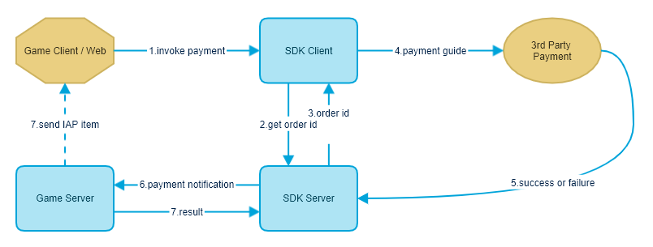

# 内购商品支付完成通知(Instant Payment Notification)

**修改记录**

| 修订号   | 修改描述       | 修改日期       |
| ----- | -------- |  ---------- |
| 1.0.0 | 初稿完成       | 2020-10-22 |
| 1.1.0 | 增加了sandbox参数   | 2020-10-30 |
| 1.2.0 | 增加了platformInfo参数   | 2021-03-04 |

### 接口说明

内购商品支付完成通知(Instant Payment Notification)由游戏商提供API给发行商设置，当玩家付款成功后发行商服务器将通知游戏商服务器。

### 流程图



图中第6步就是即时付款通知步骤, SDK服务器主动触发, 然后通过HTTP请求的方式通知游戏商游戏服务器

### 请求地址

开发商自定并告知发行商（举例：[http://yourdomain.com/ipn.php](http://yourdomain.com/ipn.php)）

### 请求方式(发行商服务器请求游戏商服务器)

POST

### 请求参数

|字段名|是否必填|类型|说明|
|---|---|---|---|
|appId|是|String|SDK平台分配的游戏id|
|accountId|是|String|SDK平台帐号|
|orderId|是|String|SDK平台订单号|
|productId|是|string|商品ID|
|serverId|是|string|游戏区服ID|
|amount|是|decimal(14,2)|金额 9.99。**注意：此参数如果价格低于商品的正常价格，也需要发送物品给玩家**|
|currency|是|string|商品支付货币类型|
|sandbox|是|int|是否是沙盒测试订单。1:是、0:否|
|platformInfo|否|string|支付平台信息，一般是支付平台订单号|
|extra|否|string|游戏请求生成订单时的透传字段，回调时保持原样返回；这里建议传递游戏内部生成的订单号|
|signature|是|string|签名 [参考签名规则](server-api-overview.md#签名规则)|

**本接口中参与签名计算的参数包含appId、accountId、orderId、productId、serverId、amount、currency、sandbox**

### 返回结果TEXT

```
// 成功
success
// 失败示例
failure
```
**注意：重复发送的通知(orderId重复)，游戏方不需要重复发送商品给玩家，但是接口必须返回成功**
